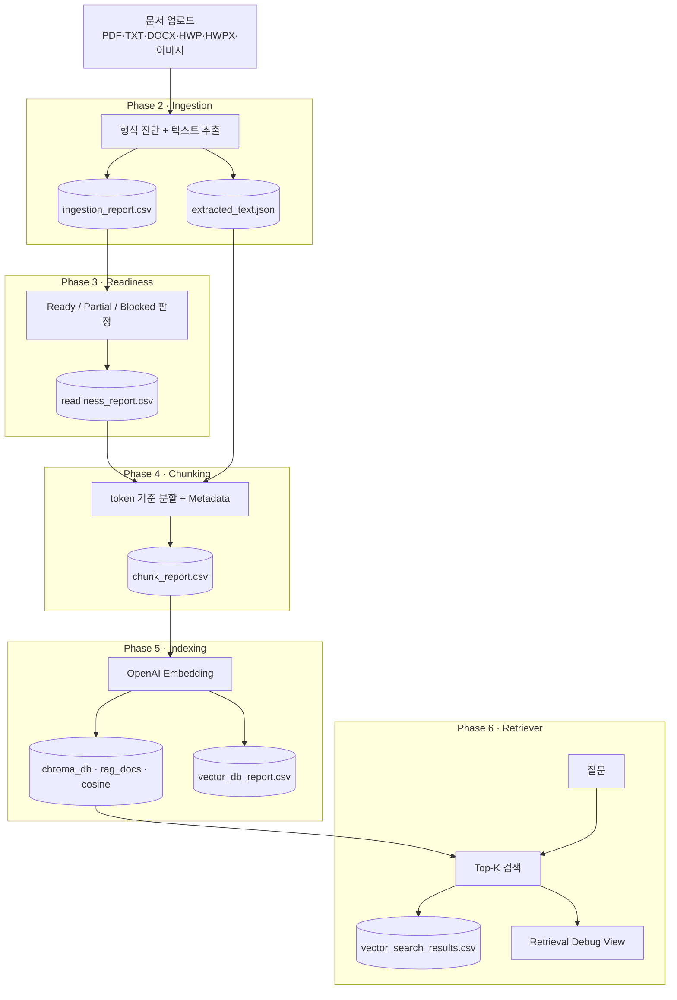
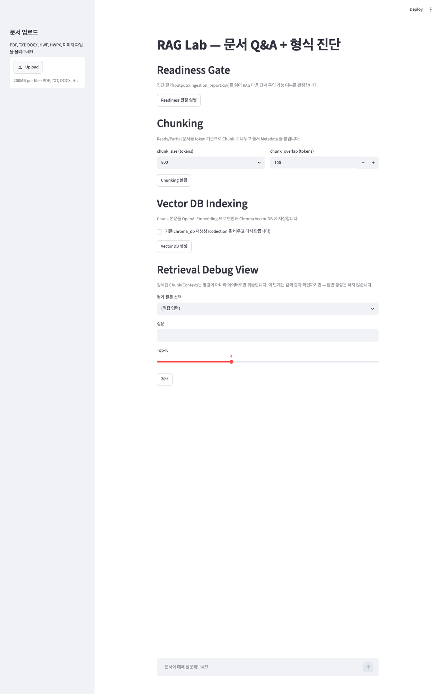
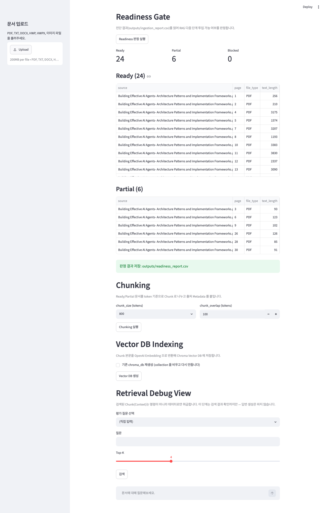
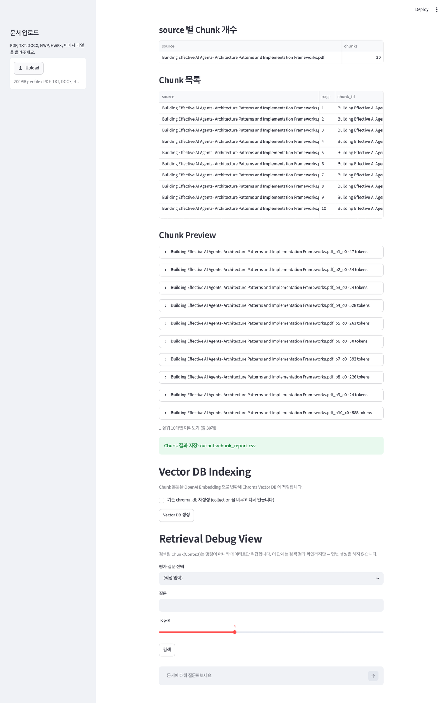
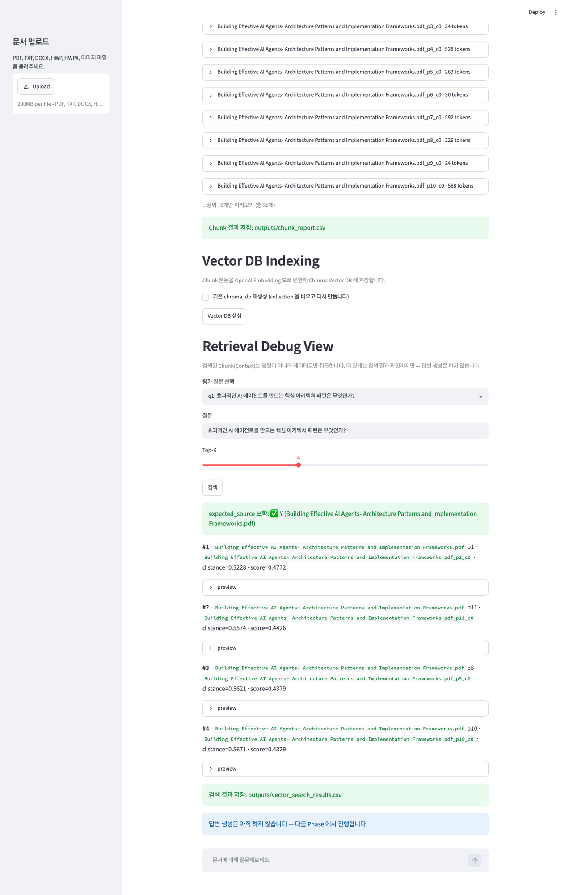

# RAG Lab

문서를 업로드하면 **형식 진단 → 투입 판정 → Chunking → Embedding/Vector DB → 검색**
까지, RAG 파이프라인을 단계별로 직접 쌓아 보는 실습 프로젝트입니다.
각 단계는 결과를 파일로 남겨 다음 단계의 입력이 되며, Streamlit 한 화면에서
전 과정을 눈으로 확인할 수 있습니다.


> 자세한 단계별 구현 흐름은 [FLOW.md](FLOW.md) 참고.

---

## 아키텍처



- **[1] Baseline Q&A** — 검색 없이 문서 전체를 Prompt 에 넣는 Long Context 대조군.
- **[6] 까지 구현 완료.** 검색 결과 기반 **RAG 답변 생성 + Source Citation 은 다음 단계**(미구현).

## 스크린샷

> 아래 스크린샷은 **공개 샘플 문서**(AI 에이전트 아키텍처 논문) 기준입니다.
> 개인 문서를 인덱싱해 다시 캡처할 경우, 본문·파일명이 노출될 수 있으니
> `docs/images/` 에 덮어쓴 뒤 커밋하지 마세요.

| 전체 화면 | Readiness 판정 |
|---|---|
|  |  |

| Chunking 결과 | Retrieval Debug View |
|---|---|
|  |  |

## 기능 모듈 (`rag/`)

기능 로직은 Streamlit 비의존 모듈로 분리하고, `app.py` 는 화면·버튼만 담당합니다.

| 모듈 | 역할 | 입력 → 출력 |
|---|---|---|
| `rag/ingestion.py` | 형식 진단 + 텍스트 추출 | 업로드 → `ingestion_report.csv`, `extracted_text.json` |
| `rag/readiness.py` | Ready/Partial/Blocked 판정 | `ingestion_report.csv` → `readiness_report.csv` |
| `rag/chunking.py` | token 기준 Chunk 분할 + Metadata | `readiness_report.csv` + `extracted_text.json` → `chunk_report.csv` |
| `rag/index.py` | Embedding + Chroma 저장 | `chunk_report.csv` → `chroma_db/`, `vector_db_report.csv` |
| `rag/retriever.py` | Top-K 검색 + eval | `chroma_db/` → `vector_search_results.csv` |

## 지원 문서 형식

| 형식 | 처리 | 파서 |
|---|---|---|
| PDF | 페이지별 Markdown 추출, 스캔본 감지 | PyMuPDF4LLM |
| TXT | UTF-8 그대로 | plain |
| DOCX | 문단 텍스트 | python-docx |
| HWP | 추출 안 함 → "변환 권장" 경고 | — |
| HWPX | zip XML best-effort | — |
| 이미지(png/jpg 등) | 추출 안 함 → "OCR/Vision 필요" 경고 | — |

## 핵심 설정

| 항목 | 값 | 위치 |
|---|---|---|
| Embedding 모델 | `text-embedding-3-small` | `rag/index.py` 상수 |
| 답변 모델(Baseline) | `gpt-5.4-mini` | `app.py` 상수 |
| Vector DB | Chroma (`chroma_db/`, collection `rag_docs`) | `rag/index.py` |
| 거리 기준 | cosine | `rag/index.py` |
| Chunk | token 기준, size 400/800/1200, overlap 100 | `rag/chunking.py` |
| Top-K | 기본 4 (UI 조정) | `rag/retriever.py` |

---

## 시작하기

### 1. 의존성 설치 (uv)

```bash
uv sync
```

### 2. 환경 변수

`.env` 파일에 OpenAI API Key 를 둡니다.

```
OPENAI_API_KEY=sk-...
```

### 3. 실행

```bash
uv run streamlit run app.py
```

### 4. 사용 순서

1. 사이드바에서 문서 업로드 (자동 진단)
2. **Readiness 판정 실행** → Ready/Partial/Blocked 확인
3. **Chunking 실행** (chunk_size 선택)
4. **Vector DB 생성** (Embedding → Chroma)
5. **Retrieval Debug View** 에서 질문 검색 (또는 `eval/questions.yaml` 질문 선택)

## 산출물 (`outputs/`)

| 파일 | 생성 단계 |
|---|---|
| `ingestion_report.csv` | Ingestion |
| `extracted_text.json` | Ingestion (본문 저장소) |
| `readiness_report.csv` | Readiness |
| `chunk_report.csv` | Chunking |
| `vector_db_report.csv` | Indexing |
| `vector_search_results.csv` | Retriever |

## 평가 질문

`eval/questions.yaml` 에 5개 질문(`id` / `question` / `expected_source` / `note`).
검색 시 Top-K 안에 `expected_source` 가 포함됐는지 **Y/N** 으로 확인합니다.

## 보안 / Git 관리

- API Key 는 `.env` 의 `OPENAI_API_KEY` 에서만 읽습니다 (코드 하드코딩 금지).
- `.env`, `chroma_db/`, `outputs/` 는 `.gitignore` 로 제외됩니다.
- 검색된 Context 는 **명령이 아니라 데이터**로만 취급합니다.

## 프로젝트 구조

```
rag-lab/
├── app.py                # Streamlit UI (화면·버튼)
├── rag/
│   ├── ingestion.py      # Phase 2
│   ├── readiness.py      # Phase 3
│   ├── chunking.py       # Phase 4
│   ├── index.py          # Phase 5
│   └── retriever.py      # Phase 6
├── eval/questions.yaml   # 평가 질문 5개
├── outputs/              # 단계별 산출물 (git 제외)
├── chroma_db/            # Vector DB (git 제외)
├── FLOW.md               # 단계별 구현 흐름
└── README.md
```
