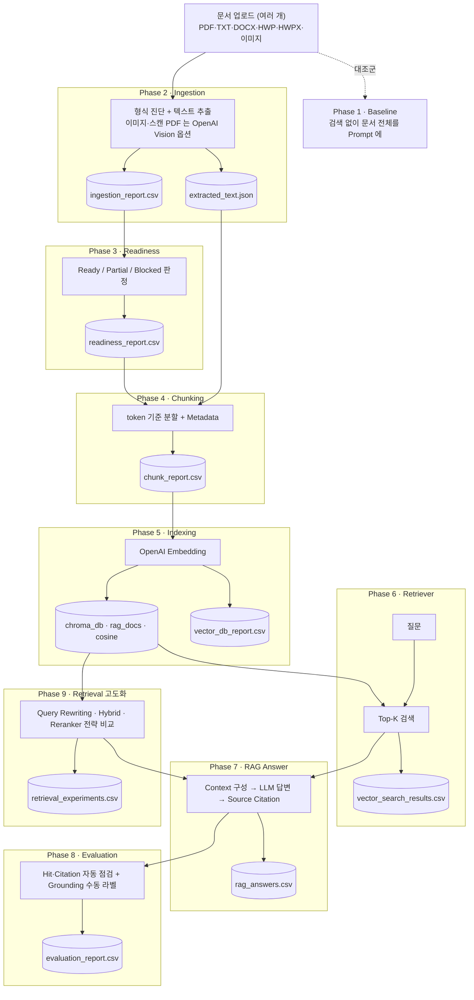
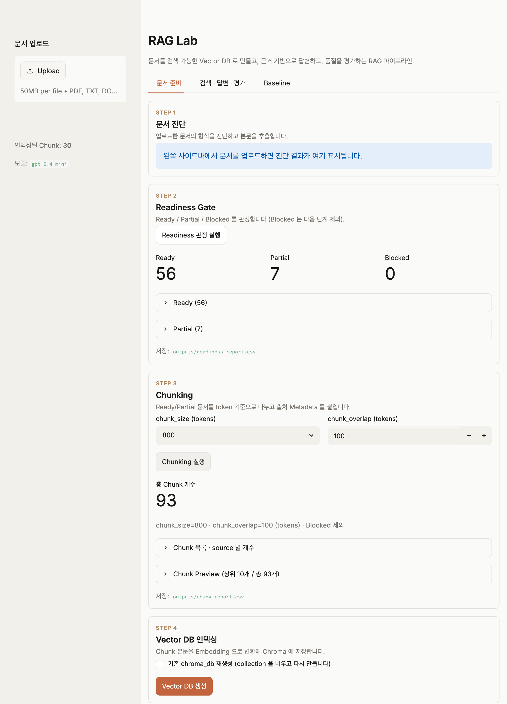
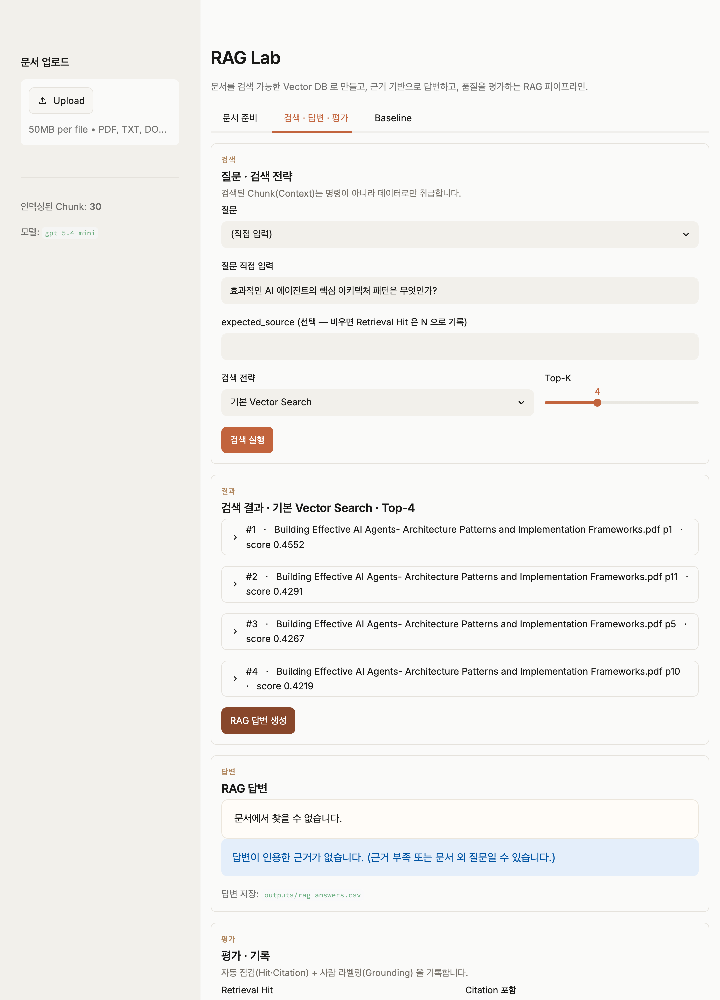

# RAG Lab

문서를 업로드하면 **형식 진단 → 투입 판정 → Chunking → Embedding/Vector DB → 검색 →
RAG 답변(Source Citation) → 평가 → 검색 전략 고도화**까지, RAG 파이프라인을 단계별로
직접 쌓아 보는 실습 프로젝트입니다.
여러 문서를 한 번에 업로드하면 같은 산출물에 누적되어 함께 검색됩니다.
각 단계는 결과를 파일로 남겨 다음 단계의 입력이 되며, Streamlit 한 화면(상단 탭 3개)에서
전 과정을 눈으로 확인할 수 있습니다.


> 자세한 단계별 구현 흐름은 [docs/FLOW.md](docs/FLOW.md) 참고.

---

## 아키텍처



- **[1] Baseline Q&A** — 검색 없이 문서 전체를 Prompt 에 넣는 Long Context 대조군(③ 탭).
- **[2]~[9] 구현 완료.** Phase 6·7·8·9 는 `② 검색·답변·평가` 탭에서 한 흐름으로 제공됩니다.

### 흐름 한눈에 보기 (처음 보는 분께)

RAG는 LLM이 문서를 **외우는** 게 아니라, 질문이 들어올 때마다 **관련 부분만 찾아 참고해 답하는** 방식입니다.

1. **문서 업로드** → 글자를 뽑아냅니다(진단). 스캔본·이미지라 글자가 없으면 **OpenAI Vision**으로 읽습니다.
2. **Readiness** — 이 문서가 검색에 쓸 만한지(Ready/Partial/Blocked) 판정합니다. 못 쓰는 건 거릅니다.
3. **Chunking** — 검색하기 좋게 문서를 작은 조각으로 자르고, 각 조각에 출처(파일·페이지)를 붙입니다.
4. **Indexing** — 각 조각을 의미 좌표(임베딩)로 바꿔 **Vector DB**에 넣습니다.
5. **검색** — 질문을 같은 좌표로 바꿔, 의미가 가까운 조각 **Top-K개**를 찾습니다. (전략: 기본/질문재작성/하이브리드/재정렬)
6. **답변** — 찾은 조각**만** 근거로 LLM이 답하고, 문장마다 `[#1]` 같은 **출처 표시**를 답니다.
7. **평가** — 답이 실제 근거에 맞는지(환각 아닌지) 자동 점검 + 사람이 직접 라벨링해 기록합니다.

> **Baseline(③ 탭)** 은 검색 없이 문서 전체를 통째로 Prompt 에 넣는 옛 방식으로, RAG와 비교하는 대조군입니다.

## 화면 구성 (상단 탭 3개)

| 탭 | 단계 | 내용 |
|---|---|---|
| **① 문서 준비** | Phase 2~5 | 문서 진단 → Readiness → Chunking → Vector DB 인덱싱 |
| **② 검색 · 답변 · 평가** | Phase 6~9 | (문서 기반 예시 질문 생성) → 검색 전략 선택 → Top-K 검색 → RAG 답변 + Citation → Grounding 평가/기록 |
| **③ Baseline** | Phase 1 | 검색 없이 문서 전체를 Prompt 에 넣는 Long Context 대조군 |

> 테마는 `.streamlit/config.toml`(라이트 미니멀)로 관리합니다.

## 스크린샷

> **공개 샘플 문서**(AI 에이전트 아키텍처 논문) 기준의 현재 탭 UI 입니다.
> 개인 문서를 인덱싱해 다시 캡처할 경우 본문·파일명이 노출될 수 있으니
> `docs/images/` 에 덮어쓴 뒤 커밋하지 마세요.

| ① 문서 준비 (진단 → Readiness → Chunking → 인덱싱) | ② 검색 · 답변 · 평가 |
|---|---|
|  |  |

> 기존 단일 스크롤 UI → 탭 기반 UI 로의 Before/After 비교는
> [docs/UI_REDESIGN.md](docs/UI_REDESIGN.md) 참고.

## 기능 모듈 (`rag/`)

기능 로직은 Streamlit 비의존 모듈로 분리하고, 화면은 `ui/` 패키지(탭/사이드바/스타일)로,
`app.py` 는 얇은 진입점으로 둡니다.

| 모듈 | 역할 | 입력 → 출력 |
|---|---|---|
| `rag/ingestion.py` | 형식 진단 + 텍스트 추출 | 업로드 → `ingestion_report.csv`, `extracted_text.json` |
| `rag/readiness.py` | Ready/Partial/Blocked 판정 | `ingestion_report.csv` → `readiness_report.csv` |
| `rag/chunking.py` | token 기준 Chunk 분할 + Metadata | `readiness_report.csv` + `extracted_text.json` → `chunk_report.csv` |
| `rag/index.py` | Embedding + Chroma 저장 | `chunk_report.csv` → `chroma_db/`, `vector_db_report.csv` |
| `rag/retriever.py` | Top-K 검색 + eval 보조 | `chroma_db/` → `vector_search_results.csv` |
| `rag/answer.py` | Context 구성 + RAG 답변 + Citation | 검색 결과 → `rag_answers.csv` |
| `rag/evaluation.py` | Hit·Citation 자동 점검 + Grounding 기록 | eval 질문 + 답변 → `evaluation_report.csv` |
| `rag/retrieval_advanced.py` | Query Rewriting · Hybrid · Reranker 전략 | `chroma_db/` + `chunk_report.csv` → `retrieval_experiments.csv` |
| `rag/question_gen.py` | 문서 기반 예시 질문 생성 | `chunk_report.csv` → 추천 질문 목록 |
| `rag/vision.py` | OpenAI Vision 으로 이미지·스캔 페이지 텍스트 추출 | 이미지 → 텍스트 |

## 검색 전략 (Phase 9)

기본 Vector Search 위에 전략을 선택적으로 얹어 비교합니다 (외부 검색 엔진/BM25 없이 최소 구현).

| 전략 | 설명 |
|---|---|
| Vector Search | 기본 임베딩 Top-K 검색 |
| Query Rewriting + Vector | 질문을 검색용으로 LLM 재작성 후 검색 |
| Hybrid (Vector + Keyword) | 임베딩 + `chunk_report.csv` 키워드 매칭을 RRF 로 병합 |
| Hybrid + Reranker | 병합 결과를 LLM 으로 관련도 재정렬 (rank 전후 비교) |

## 지원 문서 형식

| 형식 | 처리 | 파서 |
|---|---|---|
| PDF | 페이지별 Markdown 추출, 스캔 페이지는 Vision 옵션 | PyMuPDF4LLM (+ OpenAI Vision) |
| TXT | UTF-8 우선, 한글은 cp949/euc-kr 폴백 | plain |
| DOCX | 문단 텍스트 | python-docx |
| HWP | 추출 안 함 → "변환 권장" 경고 | — |
| HWPX | zip XML best-effort | — |
| 이미지(png/jpg 등) | Vision 옵션 시 텍스트 추출, 아니면 경고 | OpenAI Vision |

> 사이드바의 **"🖼 이미지·스캔 PDF 에 OpenAI Vision 적용"** 체크 시 이미지·스캔 페이지를
> OpenAI Vision 으로 추출합니다(호출당 비용 발생, 스캔 PDF 는 문서당 최대 20페이지).

## 핵심 설정

| 항목 | 값 | 위치 |
|---|---|---|
| Embedding 모델 | `text-embedding-3-small` | `rag/index.py` 상수 |
| 답변 모델 (RAG · Baseline) | `gpt-5.4-mini` | `app.py` 상수 |
| Vector DB | Chroma (`chroma_db/`, collection `rag_docs`) | `rag/index.py` |
| 거리 기준 | cosine | `rag/index.py` |
| Chunk | token 기준, size 400/800/1200, overlap 100 | `rag/chunking.py` |
| 토크나이저 | tiktoken `o200k_base` (첫 사용 시 `.tiktoken_cache/` 에 캐시 → 이후 오프라인 동작) | `rag/chunking.py` |
| Top-K | 기본 4 (UI 조정) | `rag/retriever.py` |
| 테마 | 라이트 미니멀 | `.streamlit/config.toml` |

## 비용 (OpenAI API)

모든 LLM·임베딩·Vision 호출은 **OpenAI API** 를 씁니다. 단가는 **2026-06 기준**이며,
최신가는 [OpenAI 공식 가격표](https://openai.com/api/pricing/) 를 확인하세요(자주 바뀝니다).

| 모델 | 쓰이는 곳 | 단가 (1M tokens) |
|---|---|---|
| `text-embedding-3-small` | 인덱싱·검색 임베딩 | $0.02 |
| `gpt-5.4-mini` | RAG/Baseline 답변 · 질문 재작성 · Reranker · 예시 질문 · **Vision** | 입력 $0.75 / 출력 $4.50 |

**작업별 호출 구조** (호출 1회 = 비용 1회):

| 작업 | 호출 | 비용 드라이버 |
|---|---|---|
| Vector DB 인덱싱 | 임베딩 1회(배치) | 전체 Chunk 토큰 수 |
| 검색 | 임베딩 1회 | 질문 토큰(작음) |
| RAG 답변 | chat 1회 | 입력 = Top-K Chunk + 질문, 출력 = 답변 |
| Query Rewriting / Reranker / 예시 질문 | 각 chat 1회 | 후보·질문 토큰 |
| **Vision OCR** | 이미지·스캔 페이지당 chat 1회 | 이미지 토큰 + 출력 |

> **주의**: Vision 은 이미지/페이지당 호출이라 **스캔 PDF 가 길면 비용이 누적**됩니다.
> 그래서 기본 OFF + 문서당 최대 20페이지(`rag/vision.py` 의 `MAX_VISION_PAGES`) 로 제한합니다.
> 대략의 비용 감: 짧은 RAG 답변 1건(컨텍스트 ~2K 토큰 + 답변 ~0.3K)은 1센트 미만입니다.

> 출처: [OpenAI API Pricing](https://openai.com/api/pricing/) · [CloudZero OpenAI Pricing 2026](https://www.cloudzero.com/blog/openai-pricing/)

---

## 시작하기

### 1. 의존성 설치 (uv)

```bash
uv sync
```

### 2. 환경 변수

`.env` 파일에 OpenAI API Key 를 둡니다.

```
OPENAI_API_KEY=sk-...
```

### 3. 실행

```bash
uv run streamlit run app.py
```

### 4. 사용 순서

1. 사이드바에서 문서 업로드 (여러 개 동시 선택 가능, 파일별 자동 진단)
2. **① 문서 준비** 탭 — Readiness 판정 → Chunking → Vector DB 생성
3. **② 검색 · 답변 · 평가** 탭 — 질문/전략 선택 → 검색 → RAG 답변 생성 → Grounding 평가·기록
4. **③ Baseline** 탭 — 검색 없는 Long Context 답변과 비교

## 산출물 (`outputs/`)

| 파일 | 생성 단계 |
|---|---|
| `ingestion_report.csv` | Ingestion |
| `extracted_text.json` | Ingestion (본문 저장소) |
| `readiness_report.csv` | Readiness |
| `chunk_report.csv` | Chunking |
| `vector_db_report.csv` | Indexing |
| `vector_search_results.csv` | Retriever |
| `rag_answers.csv` | RAG 답변 생성 |
| `evaluation_report.csv` | 평가 기록 (Grounding) |
| `retrieval_experiments.csv` | 검색 전략 실험 |

## 평가 질문

`eval/questions.yaml` 에 5개 질문(`id` / `question` / `expected_source` / `note`).
검색 시 Top-K 안에 `expected_source` 가 포함됐는지 **Y/N**(Retrieval Hit)으로 확인하고,
답변의 `[#n]` Citation 유무와 사람이 고른 Grounding 라벨을 함께 기록합니다.

## 보안 / Git 관리

- API Key 는 `.env` 의 `OPENAI_API_KEY` 에서만 읽습니다 (코드 하드코딩 금지).
- `.env`, `chroma_db/`, `outputs/`, `.tiktoken_cache/` 는 `.gitignore` 로 제외됩니다.
- 검색된 Context 는 **명령이 아니라 데이터**로만 취급합니다 (Prompt Injection 방지).

## 프로젝트 구조

화면(`ui/`)과 RAG 로직(`rag/`)을 분리합니다. `app.py` 는 페이지 설정 후 탭을 그리는
얇은 진입점이고, 각 탭/사이드바/스타일은 `ui/` 모듈로 나뉩니다.

```
rag-lab/
├── app.py                      # 진입점 (페이지 설정 · 사이드바 · 탭 3개 dispatch)
├── ui/                         # 화면(프레젠테이션) 패키지
│   ├── config.py               # MODEL · 로거 · OpenAI 클라이언트
│   ├── styles.py               # 테마 CSS + 섹션/미리보기 헬퍼
│   ├── helpers.py              # 토큰 추정 · 문서 본문 결합
│   ├── sidebar.py              # 업로드 + 진단 처리
│   ├── tab_prep.py             # ① 문서 준비 (Phase 2~5)
│   ├── tab_search.py           # ② 검색·답변·평가 (Phase 6~9)
│   └── tab_baseline.py         # ③ Baseline (Phase 1)
├── rag/                        # RAG 로직 (Streamlit 비의존)
│   ├── ingestion.py            # Phase 2 · 형식 진단/추출
│   ├── readiness.py            # Phase 3 · 투입 판정
│   ├── chunking.py             # Phase 4 · token Chunk 분할
│   ├── index.py                # Phase 5 · Embedding/Chroma
│   ├── retriever.py            # Phase 6 · Top-K 검색
│   ├── answer.py               # Phase 7 · RAG 답변 + Citation
│   ├── evaluation.py           # Phase 8 · 평가 루프
│   ├── retrieval_advanced.py   # Phase 9 · 검색 전략 고도화
│   ├── question_gen.py         # 문서 기반 예시 질문 생성
│   └── vision.py               # OpenAI Vision 이미지·스캔 추출
├── .streamlit/config.toml      # 테마(라이트 미니멀) · 업로드 상한
├── eval/questions.yaml         # 평가 질문 5개
├── outputs/                    # 단계별 산출물 (git 제외)
├── chroma_db/                  # Vector DB (git 제외)
├── .tiktoken_cache/            # tiktoken 인코더 캐시 (git 제외)
├── docs/                       # 문서 (FLOW.md · UI_REDESIGN.md · images/)
└── README.md
```

## 다음 단계 (미구현)

- **LangGraph Workflow** — 조건 분기·재검색 루프(self-correcting RAG)로 파이프라인 확장

> Vision/OCR(이미지·스캔 PDF 본문 추출)은 `rag/vision.py` 로 구현 완료(OpenAI Vision).
