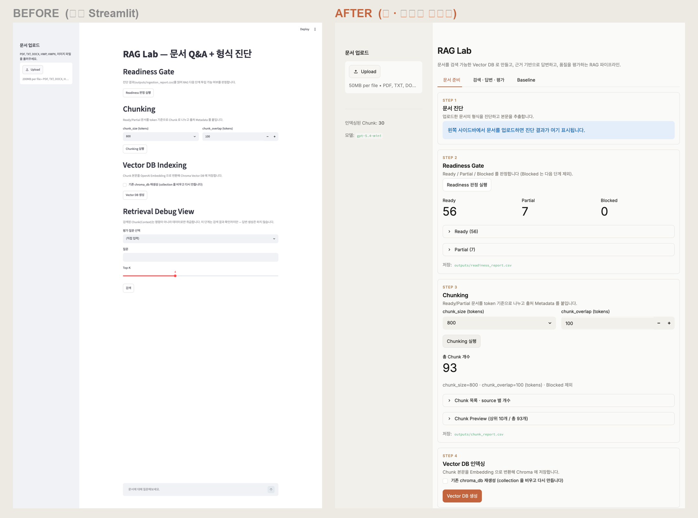
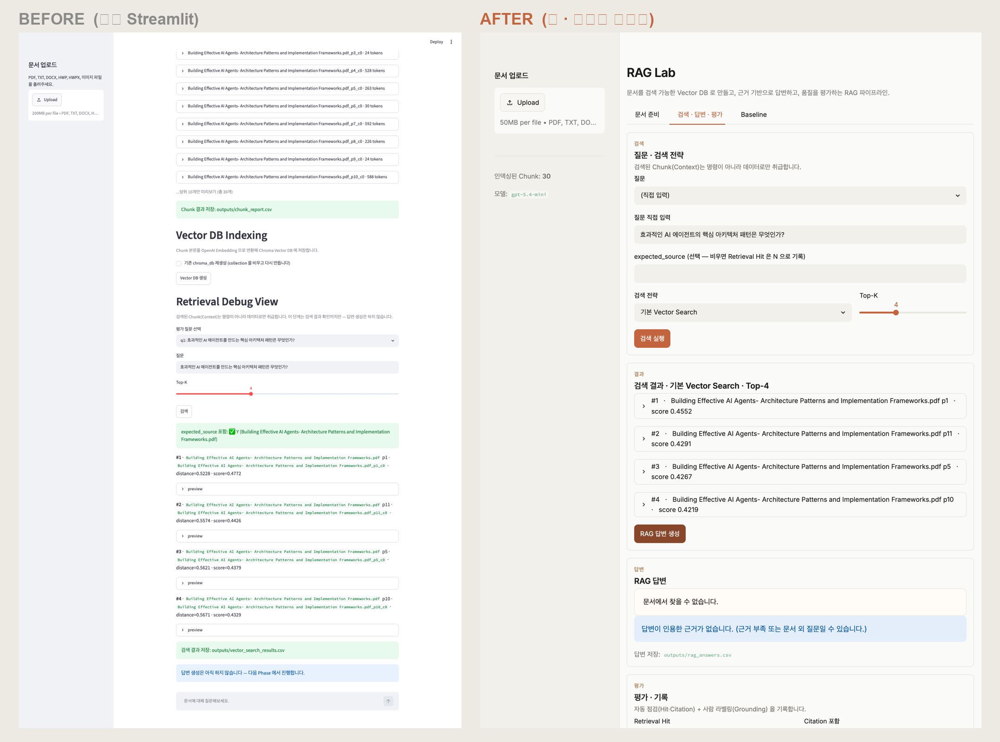

# RAG Lab — UI/UX 리디자인 기록

기존 Streamlit 기본 UI(단일 세로 스크롤·모놀리식 `app.py`)를 현재의 모던한
탭 기반 UI로 바꾼 과정을 **요청 → 작업 → 결과** 순으로 단계별 정리한 문서입니다.
이후 진행 방향을 정하기 위한 참고용입니다.

> 관련 문서: 파이프라인 단계는 [FLOW.md](FLOW.md), 전체 개요는 [README.md](../README.md).

---

## 출발점 (Before)

- **레이아웃**: 한 페이지에 모든 단계(Readiness · Chunking · Vector DB · Retrieval Debug ·
  평가 · 검색 전략 실험 · 대화)가 세로로 끝없이 쌓임 → 스크롤 지옥.
- **중복**: 검색→답변을 하는 패널이 3개(Debug View · 전략 실험 · 평가)로 겹침.
  Top-K 슬라이더·질문 입력·검색 버튼·답변 표시가 3벌씩.
- **룩앤필**: "딱 봐도 기본 Streamlit". 굵은 기본 헤더, raw 마크다운 덤프, 안내 메시지 노이즈.
- **코드**: `app.py` 한 파일 634줄 모놀리스.
- **숨은 버그**: 멀티파일 업로드 도입 때 Baseline 대화가 `ingest_result`(미설정 키)를
  참조해 **항상 "업로드하세요"만 출력**.

---

## 단계별 진행

### STEP 1 — 사소한 정리: deprecation 경고 제거
- **요청**: 터미널의 `use_container_width will be removed` 경고 디버깅.
- **작업**: `st.dataframe(...)` 3곳의 `use_container_width=True` → `width="stretch"`.
- **결과**: 경고 제거. (기능·레이아웃 변화 없음)

### STEP 2 — 1차 리디자인: 구조 + 테마
- **요청**: "깔끔하고 모던하게, AI가 만든 것 같지 않게. 디자인 레퍼런스 찾아서 적용하고,
  불필요한 스텝도 최적화."
- **사전 조사**: Streamlit `config.toml` 테마 시스템(폰트·색·radius·보더) +
  공식 레퍼런스(Anthropic-inspired light) 확인.
- **방향 결정(사용자 선택)**:
  - 레이아웃 → **상단 탭** (끝없는 스크롤 해소)
  - 중복 패널 → **하나로 통합**
  - 테마 → **라이트 미니멀(Anthropic풍)**
- **작업**:
  1. `.streamlit/config.toml` 신설 — 라이트 미니멀 테마(`#FAFAF9` 배경, 테라코타 primary, Inter).
  2. 상단 **탭 3개**: `① 문서 준비` / `② 검색·답변·평가` / `③ Baseline`.
  3. 중복 검색·답변 패널 **3개 → 1개**로 통합(전략 선택→답변→Grounding 평가까지 한 흐름).
  4. 깨진 **Baseline 수정**(`ingest_cache` 기반 전 문서 본문 결합).
  5. `generate_answer` **중복 호출 제거**, `st.success` 안내 노이즈 축소.
- **결과**: 탭 구조로 전환, 스크롤 대폭 감소, 중복 제거. (단 아직 "기본 Streamlit 톤"은 남음)

### STEP 3 — 2차 폴리시: 시각 디테일
- **요청**: "색상만 바꾼 게 아니라 **전체 시스템 UXUI를 깔끔하게**" (스크린샷 첨부).
  + 로그의 `MuPDF error` 디버깅.
- **작업**:
  1. **커스텀 CSS 레이어** — 타이포 스케일 다운, Streamlit 크롬(메뉴/툴바/footer) 숨김,
     본문 폭 860px, 카드 배경, 미리보기/답변 박스 스타일.
  2. 모든 섹션을 **카드(`st.container(border=True)`)** 로 그룹화.
  3. **eyebrow + 제목 + 설명** 3단 커스텀 섹션 헤더(`section()`).
  4. 진단 뷰의 **raw 마크다운 덤프 → 메타데이터 표 + 단정한 스크롤 박스**(`preview_box()`).
  5. **MuPDF 잡음 억제**: `fitz.TOOLS.mupdf_display_errors(False)` (추출은 정상 유지).
- **결과**: "기본 Streamlit" 느낌 탈피. 카드·여백·타이포가 의도된 디자인으로 정리됨.

### STEP 4 — 모듈화 + 보안 + 실측 검증
- **요청**: "Playwright로 UXUI 확인하고 엄밀하게 업데이트" / "각 코드 엄밀하게 모듈화" /
  "보안도 엄밀하게".
- **작업 — 모듈화**: `app.py` **634줄 → 53줄** 진입점으로 축소, 화면을 `ui/` 패키지로 분리.
  ```
  ui/config.py · styles.py · helpers.py · sidebar.py
  ui/tab_prep.py · tab_search.py · tab_baseline.py
  ```
- **작업 — 보안**:
  - HWPX zip **압축 폭탄 가드**(해제 누적 50MB 상한).
  - 업로드 크기 상한 `maxUploadSize = 50`MB.
  - 하드코딩 시크릿 grep(0건), `.env`/`outputs/`/`chroma_db/`/`eval/questions.yaml` gitignore 확인.
  - HTML escape(preview/answer/section), Context=데이터 system prompt(Prompt Injection 방지).
- **작업 — 검증**: Playwright로 실제 앱 기동 → 탭 3개 + 검색→답변 플로우 **5장 캡처** 확인,
  `streamlit.testing` AppTest 예외 0.
- **결과**: 화면(`ui/`)과 로직(`rag/`)이 깔끔히 분리, 보안 가드 추가, 실측 검증 완료.

### STEP 5 — 문서 최신화
- **요청**: README / FLOW.md 최신화.
- **작업**: README를 Phase 1~9 + 탭 UI + `ui/` 구조로 전면 갱신,
  FLOW.md 관심사 분리 항목에 `ui/` 분리 반영.
- **결과**: 문서와 코드 일치(doc drift 해소).

### STEP 6 — 편의 기능: 문서 기반 예시 질문 생성
- **요청**: `② 검색` 탭에서 넣은 문서 기반으로 예시 질문을 생성하는 시스템.
- **작업**: `rag/question_gen.py` 신설(인덱싱 Chunk 표본 → LLM 으로 답변 가능한 한국어 질문 생성),
  `ui/tab_search.py` 직접 입력 모드에 "문서 기반 예시 질문 생성" 버튼 + 클릭 시 입력칸 채우기.
- **결과**: Playwright 로 5개 추천 생성 → 클릭 시 입력칸 채워짐 확인. 자연스러운 질문이 되도록 프롬프트 보정.

---

## Before / After 비교 이미지

> Before = 탭 도입 이전(기존 Streamlit), After = 현재(탭·라이트 미니멀). 둘 다 공개 샘플 문서 기준.

**전체 구조** — 단일 세로 스크롤 → 탭 + 카드(STEP)



**검색 · 답변** — 평면 Debug View → 검색 결과·답변·평가 카드



| 종류 | 파일 |
|---|---|
| 비교 합성본 | `docs/images/compare-01-overview.png`, `compare-02-search.png` |
| After 단독 | `docs/images/after-01-prep.png`, `after-02-search.png` |
| Before 단독 (옛 UI) | `docs/images/01-overview.png` ~ `04-retrieval.png` |

---

## 결과 (After)

| 항목 | Before | After |
|---|---|---|
| 레이아웃 | 단일 세로 스크롤 | 상단 탭 3개 |
| 검색·답변 패널 | 3개 중복 | 1개 통합 |
| 룩앤필 | 기본 Streamlit | 라이트 미니멀(카드·eyebrow·테라코타) |
| `app.py` | 634줄 모놀리스 | 53줄 진입점 + `ui/` 8모듈 |
| Baseline | 깨짐(항상 안내) | 전 문서 본문으로 동작 |
| 보안 | 기본 | zip-bomb 가드·업로드 상한·escape |

---

## 다음 단계 (권장)

진행 우선순위 참고용. 상황에 맞게 취사선택하세요.

### 바로 할 만한 것
- [ ] **스크린샷 재캡처**: `docs/images/`(01~04)는 탭 도입 **이전** 화면 → 현재 UI로 교체.
- [ ] **git 커밋 정리**: 현재 Phase 7~9 + UI 작업이 전부 uncommitted.
      이슈 단위(예: `feat: tabbed UI + ui/ modularization`)로 나눠 커밋 권장.
- [ ] **답변 grounding 강도 튜닝**: 강화된 프롬프트가 일부 유효 질문도 보수적으로 거절.
      거절/답변 임계를 약간 완화할지 검토.

### 품질·견고성
- [ ] **테스트 추가**: `rag/*.py` 순수 로직에 `pytest`(이미 단위 검증한 함수들 회귀 방지).
- [ ] **Inter 폰트 오프라인 번들**: 현재 CDN 의존 → 방화벽/오프라인 환경 대비 로컬 번들.
- [ ] **에러 메시지 정리**: `st.error(f"...: {e}")` 의 예외 원문 노출을 사용자 친화 메시지로.

### 기능 로드맵 (FLOW "다음 단계")
- [ ] **LangGraph Workflow**: 조건 분기·재검색 루프로 파이프라인 확장.
- [x] **Vision/OCR**: 이미지·스캔 PDF 본문 추출 — `rag/vision.py`(OpenAI Vision) 로 구현 완료.

### UX 추가 개선 아이디어
- [ ] 빈 상태(empty state) 안내 일관화, 진행 단계 시각화(① → ② → ③ 흐름 힌트).
- [ ] 검색 전략별 결과를 **나란히 비교**하는 뷰(현재는 한 번에 한 전략).
- [ ] 평가 이력(`evaluation_report.csv`)을 앱 안에서 **대시보드**로 조회.
